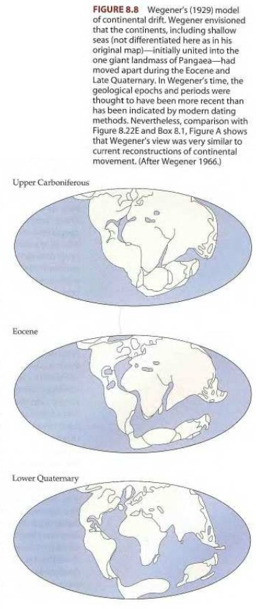

```{r setup, include=FALSE}
knitr::opts_chunk$set(echo = FALSE)
```

## Los cambios en la Tierra

## 

## 

## 

## 

## 

## 

## 

## 

## 

## 

## 

## 

## 

## 

## 

## 

## 

## 

## 

## 

## 

## 

## 

## Procesos fundamentales en biogeografía

* Evolución.

* Extinción.

* Dispersión.

* Evolución y extinción están afectadas por la dispersión, y las tres por el contexto geográfico.

## 

## 

## 

## 

## 

## 

## 

## Mecanismos de diferenciación genética

* La divergencia a partir de una especies ancestral en una o más descendientes requiere de cambios genéticos.

* Las diferentes formas de un gen dentro de un mismo *locus* (posición en el cromosoma) se conocen como __alelos__, y son los responsables de las diferencias de rasgos hereditarios entre individuos.

## Mecanismos de diferenciación genética

* Los alelos se forman por...

    * __mutación__,
    
* ...y los cambios en las frecuencias de alelos ocurren principalmente por ...

    * __deriva genética__,
    * __selección natural__ y
    * __flujo genético__.

## Mutación

* Cambio en el ADN por medio de sustitución de un único nucleótido, o por medio de borrado, inserción o inversión de uno o más nucleótidos.

## Deriva genética

* Es una "fuerza" relativamente débil, porque produce cambios en la constitución genética por azar.

* Las frecuencias en los alelos cambian aleatoriamente a lo largo de varias generaciones.

* Influye en poblaciones "pequeñas".

## Selección natural

* Fuerza potente que tiene lugar cuando individuos de una población expresan rasgos genéticos que alteran su interacción con el medio para mejorar su supervivencia y su reproducción en relación con otros individuos de la población.

## Flujo genético

* Actúa en dirección opuesto a la deriva genética y a la selección natural, impidiendo de la divergencia genética.

* Si un grupo de individuos portando sus propios genes, migra hacia áreas con poblaciones aisladas, si se reproducen con éstas les "introducen" sus genes.

## Especiación alopátrica. Modo 1 o vicarianza

## 

## Especiación alopátrica. Modo 2 o periferia aislada

* Modo 2: periferia aislada

## 

## Especiación simpátrica y parapátrica

## 

## Otras formas de especiación:

* Selección disruptiva: factores ambientales aislan población y se produce especiación.


## 

## Referencias

